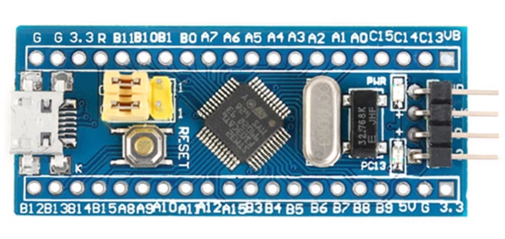

# Environmental_Sensors

This is a DIY device for monitoring ambient temperature, humidity, CO2, and TVOC levels.

硬件部分使用 LCEDA 制作，相关工程文件在 LCEDA_Project 目录下。

软件部分基于 STM32 标准库（Standard Peripheral Library）开发，工程配置参考[江协科技](https://jiangxiekeji.com/)。

## Schematic Diagram and PCB

* 原理图

  

* PCB 正面
  
  

* PCB 背面

  

## Main Components

* STM32F103C8T6 最小系统板
  
  > 最常见那种的 stm32 开发板。
  

* DHT11
  
  > 温湿度传感器，采用单总线双向通信。

* SGP30
  
  > CO2 和 TVOC 传感器，采用 I2C 通信。

* 0.96 寸 OLED 显示屏

* DC-DC 自动升降压模块
  
  > 提供稳定的 3.3V 供电。

* 18650 锂电池
  
  > 可以只用 ST-Link 供电，这样顺便省去了上面的 DC-DC 模块。

* 其他元件见原理图，PCB 和效果图，大多采用接插的方式连接。

## License

This project is licensed under the [MIT license](https://github.com/tLLWtG/Environmental_Sensors/blob/main/LICENSE). External libraries used by Environmental_Sensors are licensed under their own licenses.