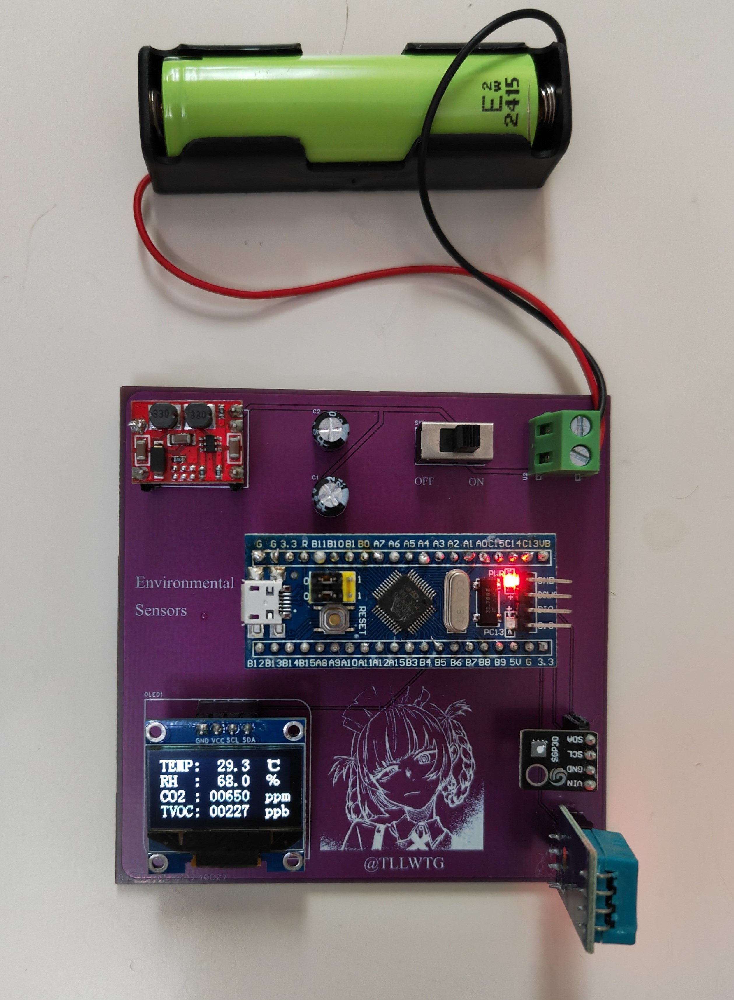
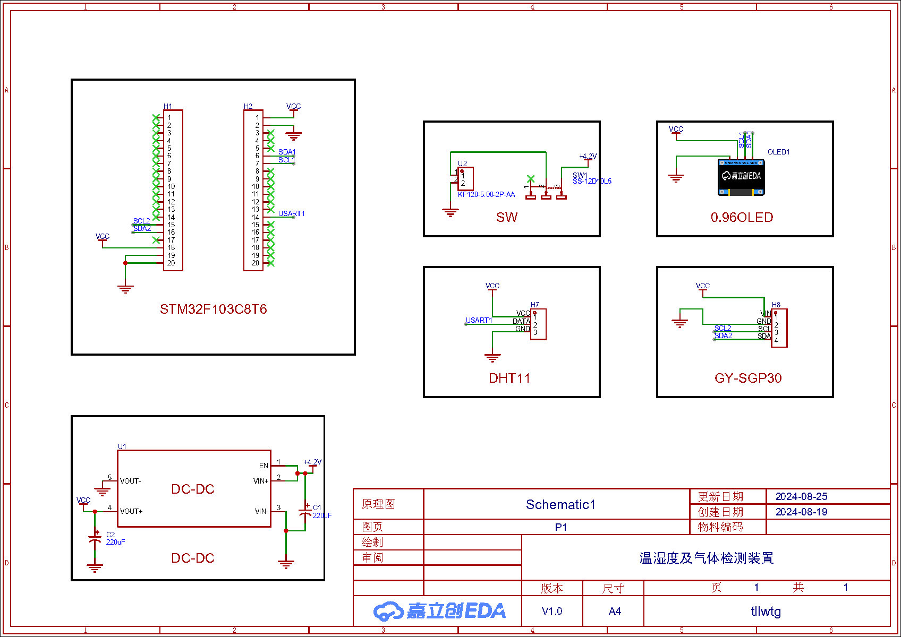
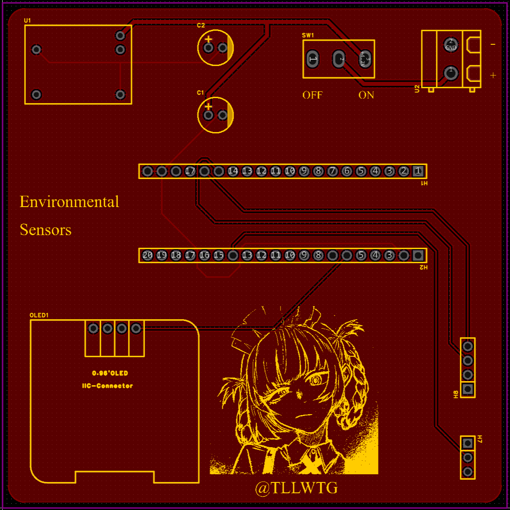
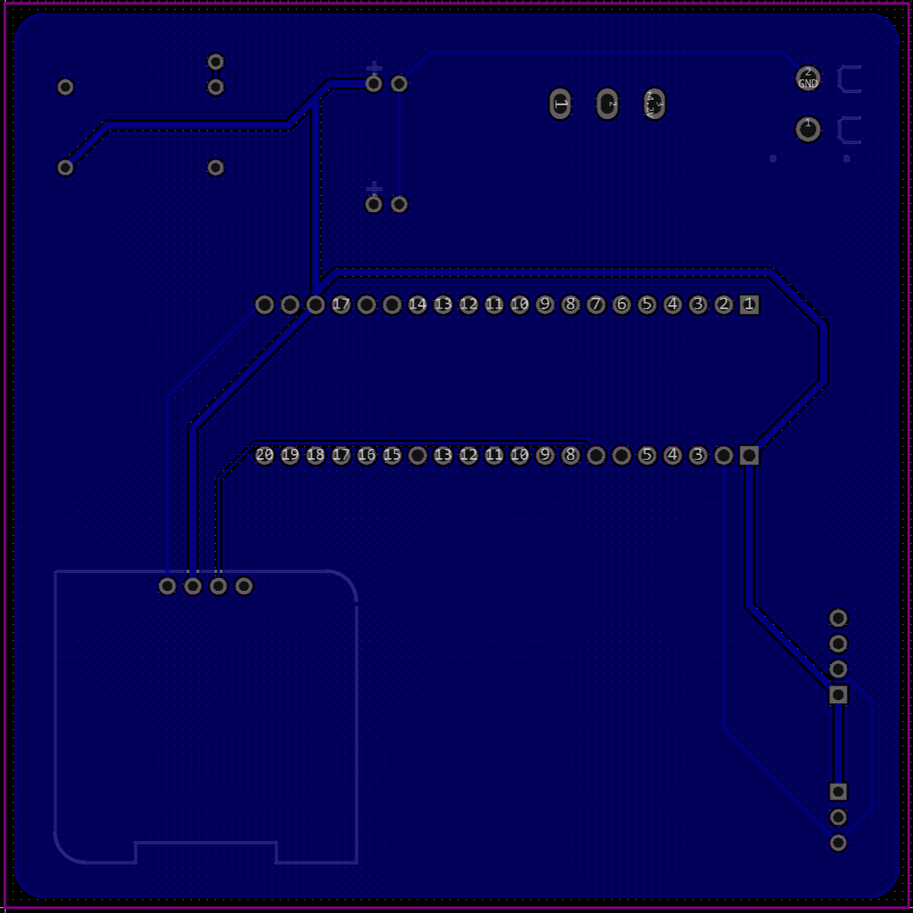

# Environmental_Sensors

This is a DIY device for monitoring ambient temperature, humidity, CO2, and TVOC levels.

硬件部分使用 LCEDA 制作，相关工程文件在 LCEDA_Project 目录下。

软件部分基于 STM32 标准库（Standard Peripheral Library）开发，其中用到的单总线双向通信和 I2C 通信均使用软件模拟实现。工程配置参考[江协科技](https://jiangxiekeji.com/)。

* **实物图**
  
  

点击展开

    
  
  
  

## Schematic Diagram and PCB

* **原理图**
  
  

点击展开

    
  

  

* **PCB 正面**

  

点击展开

    
  

  

* **PCB 背面**

  

点击展开

    
  

  

## Main Components

* **STM32F103C8T6 最小系统板**
  
  > 最常见那种的 stm32 开发板，见前面的实物图。

* **DHT11**
  
  > 温湿度传感器，采用单总线双向通信。

* **SGP30**
  
  > CO2 和 TVOC 传感器，采用 I2C 通信。

* **0.96 寸 OLED 显示屏**

* **DC-DC 自动升降压模块**
  
  > 提供稳定的 3.3V 供电。

* **18650 锂电池**
  
  > 可以只用 ST-Link 供电，这样顺便省去了上面的 DC-DC 模块。

* 其他元件见原理图，PCB 和效果图，大多采用接插的方式连接。

## 一些数据

> 环境和硬件状态会对测量结果有较大影响，数据仅供参考。

下面是某次测量得到的数据。

* **电压和电流**
  
  在电池电压为 4.08V 的条件下，电池电流稳定在 34.2mA，每隔三秒传感器进行采样时会极短暂的升高到 36.0mA。

* **温度**

  在温度 28.5℃，相对湿度 73.5% 条件下与标准测温计对比，高了约 1℃。

* **相对湿度**

  在温度 28.5℃，相对湿度 73.5% 条件下与标准湿度计对比，低了约 4%。

* **CO2**

  在通风条件下会有 100+ppm 的数值跳动。密闭环境下至多约 50ppm 的数值跳动。在通风较差的室内测得数值约为 650 ppm。 

* **TVOC**

  在通风条件下会有 50+ppb 的数值跳动。密闭环境下至多约 30ppm 的数值跳动。在通风较差的室内测得数值约为 180 ppb。 

## License

This project is licensed under the [MIT license](https://github.com/tLLWtG/Environmental_Sensors/blob/main/LICENSE). External libraries used by Environmental_Sensors are licensed under their own licenses.
